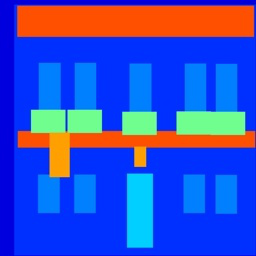
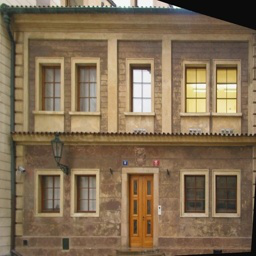
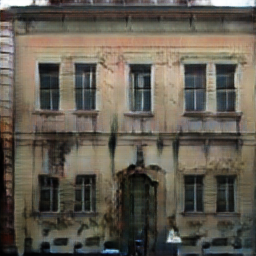
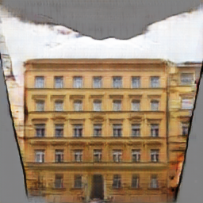
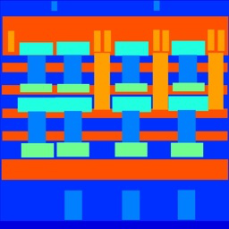
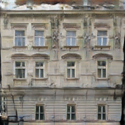
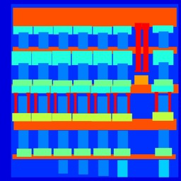
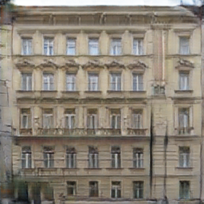

# pix2pix-TF
A minimal tensorflow implementation of pix2pix (Image-to-Image Translation with Conditional Adversarial Nets - https://phillipi.github.io/pix2pix/).

This tensorflow implementation of pix2pix is based on the [original paper from the authors](https://arxiv.org/pdf/1611.07004.pdf) and their original [torch code](https://github.com/phillipi/pix2pix). The paper discusses a GAN-based method for image translation where images from one domain (say domain A) are converted to another (say domain B). Examples include translation of semantic labels of street scenes or building facades (domain A) into natually occurring images of streets or buildings (domain B), sketches of bags or shoes (domain A) into realistic images of these objects (domain B), converting a morning scene (domain A) into an evening scene (domain B) etc.

The expected input for training the proposed models consists of pairs of images (one from domain A and another from domain B). As mentioned in the [original Torch repository](https://github.com/phillipi/pix2pix): it is faster to train on smaller datasets such as [CMP Facades dataset](http://cmp.felk.cvut.cz/~tylecr1/facade/) while the training could take much longer for more complex datasets. In this repository, currently, the results for Facades datasets are demostrated. It is straighforward to extend to more complex datasets (simply download the dataset and change the input arguments for the training and test commands below). 

# Setup

This code has been tested to work on the following environment:
- Ubuntu 14.04
- Tensorflow 0.11
- Python 2.7 (Numpy, Scikit-image)
- Cuda 8.0, CuDNN 5.1

1. Clone this repository:
```
git clone https://github.com/prashnani/pix2pix-TF.git
cd pix2pix-TF
```
2. Download a dataset using the download script provided with the [original code from authors](https://github.com/phillipi/pix2pix/blob/master/datasets/download_dataset.sh):
```
cd datasets
bash ./download_dataset.sh facades
```
NOTE: This script downloads the images provided by the authors of pix2pix which are processed versions of the original dataset. Specifically, for example in the [facades dataset](http://cmp.felk.cvut.cz/~tylecr1/facade/), the images in both domains (domain B: image of the buildings and domain A: semantic labels for the facades) are resized to 256x256 pixels and appended along width so that the final image is of size 512x256. This input is used for the image translation task: domain A -> domain B.

3. Train 
```
python main.py \
  --mode train \
  --dataset facades \
  --train_image_path ./datasets/facades/train \
  --test_image_path ./datasets/facades/val
```
NOTE: For the generator, the U-net encoder-decoder is implemented. For the discriminator, a 70x70 discriminator is implemented. Both these choices have been experimentally proven to be the best compared to some of the alternatives by the authors of pix2pix. Also, as specified in the errata in the [pix2pix paper](https://arxiv.org/pdf/1611.07004.pdf) (Sec.6.3), batchnorm is removed from bottleneck layer. 

4. Test
```
python main.py \
  --mode test \ 
  --test_image_path = ./datasets/facades/val \
  --checkpoint_name = <path to checkpoint>
```
By default, the test output is stored in *test_ouputs* directory created within the current directory. Other (optional) input args can be found in main.py. Currently, a *paired* input format is supported for both training and testing mode.

# Results on Facades dataset

Following is a comparison of the output obtained using the code from this repository (column 3) against the [output from the pixpix authors](https://phillipi.github.io/pix2pix/images/index_facades2_loss_variations.html) (column 4) as well as the ground truth output. Domain A (column 1) is the semantic annotations for facades and domain B is the real image of the corresponding building (column 2).

| domain A | domain B | tensorflow output | original torch output |
| --- | --- | --- | --- |
|  |  |  |  |
|  |  |  |  |
|  |  |  |  |
|  |  |  |  |

The above results were obtained after 200 epochs of training as prescribed in the original pi2pix paper. 

# Acknowledgements
Code is based on the original torch implementation of [pix2pix](https://github.com/phillipi/pix2pix). Thanks for the excellent work! There are two other excellent repositories on tensorflow implementations of pix2pix by [Yen-Chen Lin](https://github.com/yenchenlin/pix2pix-tensorflow) and [Christopher Hesse](https://github.com/affinelayer/pix2pix-tensorflow). 

If you use this code for your research, please cite the original pix2pix paper:
@article{pix2pix2017,
  title={Image-to-Image Translation with Conditional Adversarial Networks},
  author={Isola, Phillip and Zhu, Jun-Yan and Zhou, Tinghui and Efros, Alexei A},
  journal={CVPR},
  year={2017}
}
